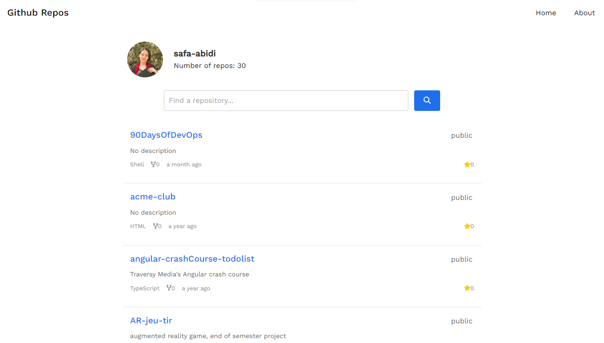

<div align="center">
  <h1>Github Repos App</h1>
    <a href="https://647e57da1c815a20709b2fd8--courageous-lollipop-292db2.netlify.app/">View Demo</a>

</div>

<!-- ABOUT THE PROJECT -->

## About The Project

This React application allows you to search for GitHub users by login and filter their repostitories. It provides a simple and intuitive user interface to fetch and display repository information from the GitHub API.  





<!-- GETTING STARTED -->

## Installation

To get a local copy up and running follow these simple steps.

1. Clone the repo
   ```sh
   git clone https://github.com/safa-abidi/github-clone-ish
   ```
2. Navigate to the project directory

   ```sh
   cd github-clone-ish
   ```

3. Install NPM packages

   ```sh
   npm install
   ```

4. Start the development server
   ```sh
   npm start
   ```

## Running Tests

```sh
npm test
```

## Running Storybook

```sh
npm run storybook
```

## Technologies Used

- ReactJs: JavaScript library for building user interfaces.
- Github API: API to fetch user and repository information.
- dayjs: JavaScript date library for manipulating, and formatting dates.
- Font Awesome: Icon library.

## Features

1. Search for GitHub repositories by entering a username.
2. Filter the repositories by name to quickly find specific ones.
3. View details of each repository, including name, description, language, forks count, last update time, etc.

## Future Improvements

- Pagination: Implement pagination to load repositories in smaller chunks, allowing users to navigate through multiple pages of results.
- Enhanced Search Features: Implement advanced search functionality to allow users to search for repositories based on various criteria, such as language and creation date.
- Test automation: Consider setting up automated testing workflows to run tests automatically on every code change.


